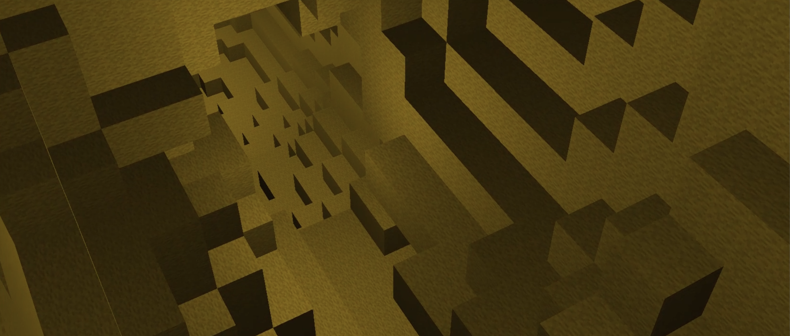
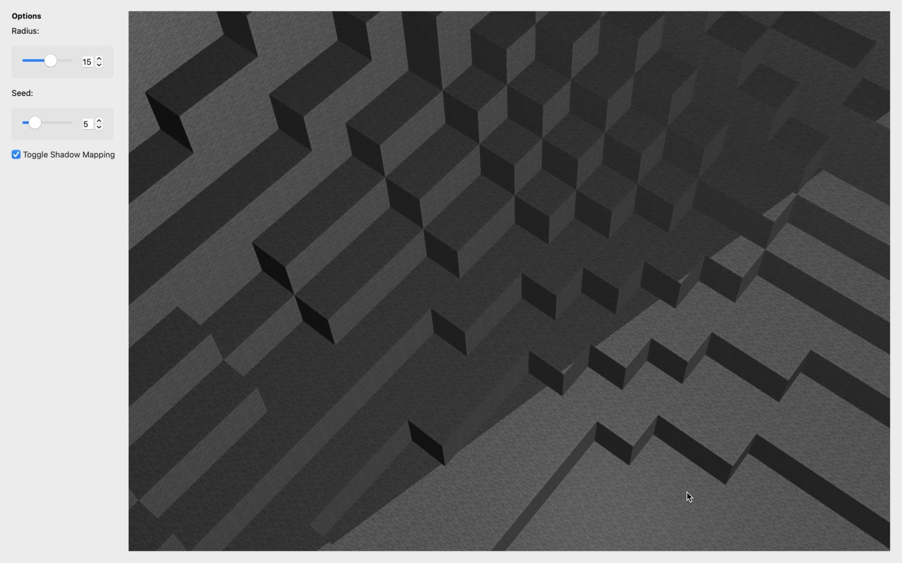
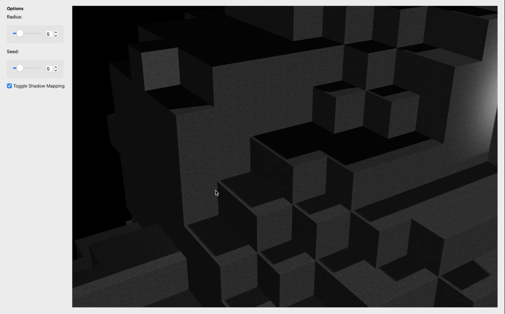

# Minecraft Cave Generation

I created & developed this project alongside three classmates for my Fall 2022 Computer Graphics course. It includes a real-time OpenGL scene viewer designed to showcase an interactive cave scene that we generated using 16,050 cubes and an innovative technique known as "perlin worms."

*You can run the program and explore the cave and the various features we implemented using the GUI.*

    

## Table of Contents
* [Technologies Used](#technologies-used)
* [General Info](#general-info)
* [Features](#features)
* [Usage Instructions](#usage-instructions)
* [Project Status](#project-status)
* [Contributions](#contributions)
<!-- * [License](#license) -->

## Technologies Used
C++, OpenGL

## General Info

The Real-Time OpenGL Cave Scene Viewer is a visually stunning application that allows users to explore a highly interactive cave environment. This project showcases the capabilities of real-time rendering and advanced techniques like shadow mapping and edge smoothing using Percentage Closer Filtering (PCF) to achieve a more realistic and immersive experience.

## Features

The cave was generated using a method of procedural terrain generation using Perlin noise. Caves are carved out by spheres that have their radius and position affected by perlin noise. The GUI allows you to change 2 parameters: radius and seed. Users can increase the size of the cave by opting for a greater radius or they can generate more complex caves by increasing the seed parameter.

The camera can move smoothy along a bezier curve (a predetermined path through the cave) if the user presses "F" on the keyboard. The bezier curve is defined along 4 control points. From these points we found the coefficient of the cubic polynomial representing the curve in world space.

Texture mapping was implemented to map the minecraft-esque stone texture onto the cubes.

Shadow mapping was implemented for directonal lights, allowing us to cast realistic shadows for objects affected by directional light sources in the cave environment. By rendering the depth information from the light source's perspective, we achieve convincing shadow effects that add depth and dimensionality to the scene. The shadows can be toggled on and off using the GUI.

To optimize shadow quality, we use Percentage-Closer Filtering (PCF). This technique smoothens the shadow edges, reducing jagged appearances and creating a more visually appealing scene with realistic transitions between shadowed and illuminated regions.

    
     
    above: shows the shadow mapping inside the cave.

 

    
     
    above: shows the shadow mapping outside the cave.

## Usage Instructions

### To run the Cave Scene Viewer, follow these steps:

1. Install the necessary dependencies (OpenGL, GLFW, etc.).
    
2. Build the project using your preferred build system (e.g., CMake, Make, etc.)
3. Run the code, which will make the GUI with the Cave Scene Viewer pop up
   
5. Navigate through the cave using these keyboard commands: "W" for forward, "S" for backwards, "A" for left, "D" for right, "Space" for up, "Command" for down, "F" for the camera to follow a predetermined route
   
7. Toggle shadows by ticking the box.

## Project Status
Project is: Complete (as of December 2022)

## Contributions

 I specifically worked on the real-time viewer, GUI, texture mapping, shadow mapping and PCF.
 
My group members: Troy Conklin, Nicholas Fah-Sang, Jared Cambier 
